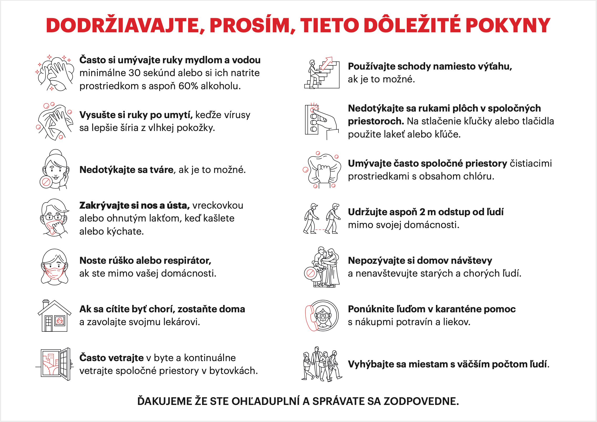

# Plagát pre domácnosti

## Cieľ tohto opatrenia

Šíriť osvetu o opatreniach na zníženie rizika nákazy koronavírusom a k zodpovednému správaniu v domácnostiach a bytových domoch. Plagát obsahuje všeobecné inštrukcie pre domácnosti a aj inštrukcie pre domácnosti v karanténe.

## Postup

1. Stiahnite si PDF súbor plagátu:
    * [stiahnuť slovenský plagát](../../files/domacnosti/domacnosti-plagat-v2020032101.pdf)
    * [stiahnuť maďarský plagát](../../files/domacnosti/domacnosti-plagat-v2020032101-hu.pdf)
    * ak viete preložiť plagát to iného jazyka, tak sa nám prosím ozvite
2. Vytlačte si súbor na vašej tlačiarni a umiestnite dve A4 na viditeľné miesto na vchodové dvere domu, do výťahu, ai.

## Náhľad plagátu

Toto je len náhľad. Na vytlačenie v dobrej kvalite si stiahnite PDF súbor vyššie.

***
Dátum poslednej aktualizácie plagátu: 21. marca 2020

> V prípade nejasností alebo otázok napíšte email na filip.likavcan@gmail.com