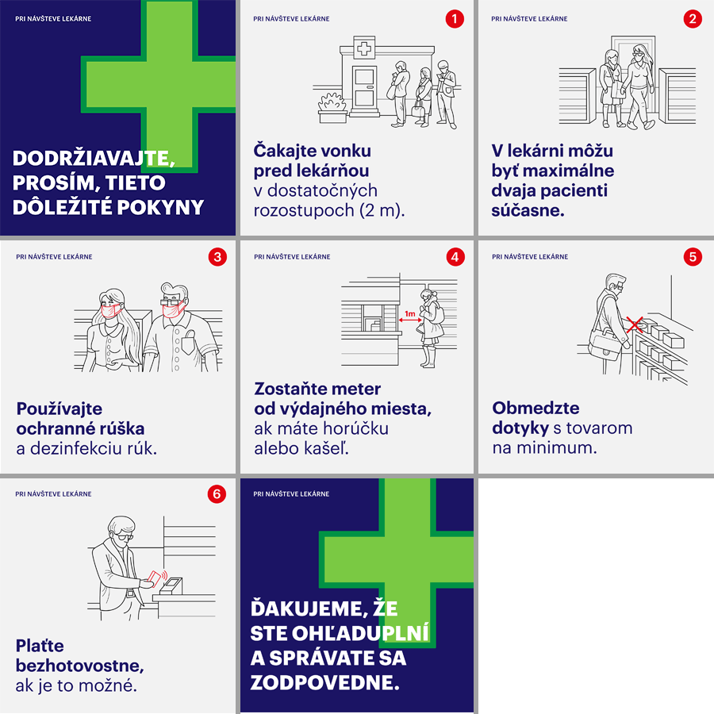

# Plagát pre lekárne

## Cieľ tohto opatrenia

Minimalizovať čas, ktorý pacient trávi v lekárni, počet ľudí, s ktorými príde do kontaktu a viesť pacientov k zodpovednému správaniu počas prítomnosti v lekárni.

## Postup pre vyvesenie na dvere lekárne

1. Stiahnite si PDF súbor plagátu:
    * [stiahnuť slovenský plagát](../../files/lekarne/lekarne-plagat-v2020031501.pdf)
    * [stiahnuť anglický plagát](../../files/lekarne/lekarne-plagat-v2020031501-en.pdf)
2. Vytlačte si súbor na vašej tlačiarni a umiestnite dve A4 na viditeľné miesto pri vstupe do lekárne (napríklad vstupné dvere)

Odporúčame na dvere lekárne zverejniť aj nedostupnosť sortimentu, na ktorý sa ľudia najčastejšie pýtajú. Napríklad rúška, dezinfekcie, ai.

## Postup pre Facebook

1. Stiahnite si [balíček obrázkov pre zdieľanie na Facebooku]({{site.baseurl}}files/lekarne/lekarne-social-media-pack.zip) (ZIP súbor)
2. Rozbaľte si balíček v počítači a pridajte obrázky do príspevku na Facebooku

## Náhľad plagátu

Toto je len náhľad. Na vytlačenie v dobrej kvalite si stiahnite PDF súbor vyššie.

***
Dátum poslednej aktualizácie plagátu: 15. marca 2020

> V prípade nejasností alebo otázok napíšte email na filip.likavcan@gmail.com
