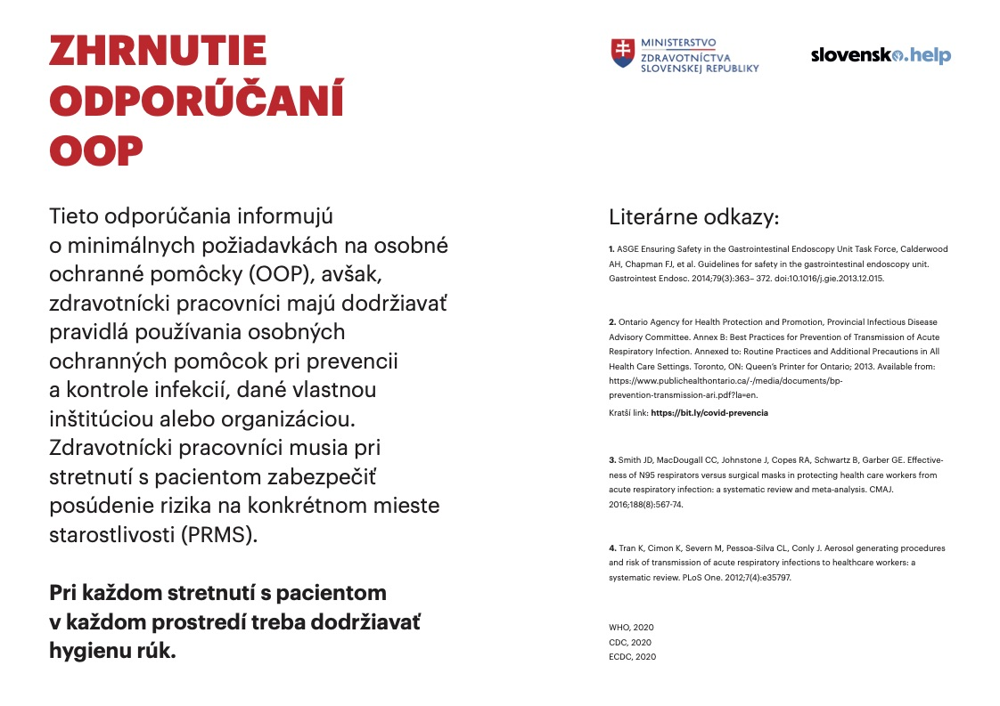
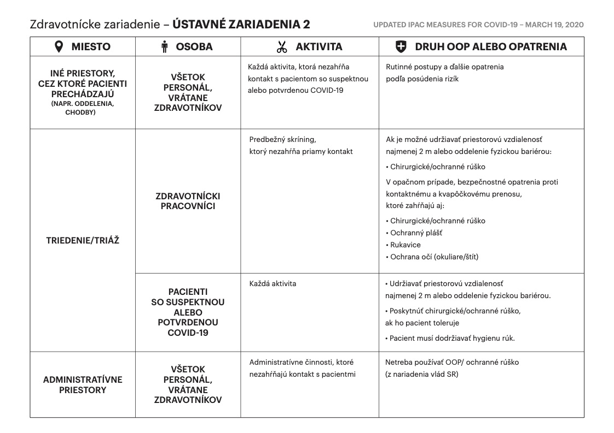
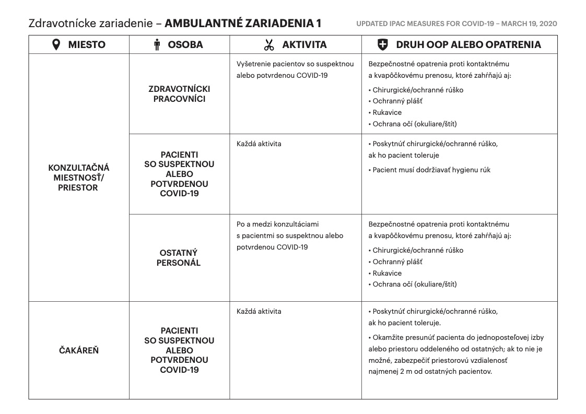
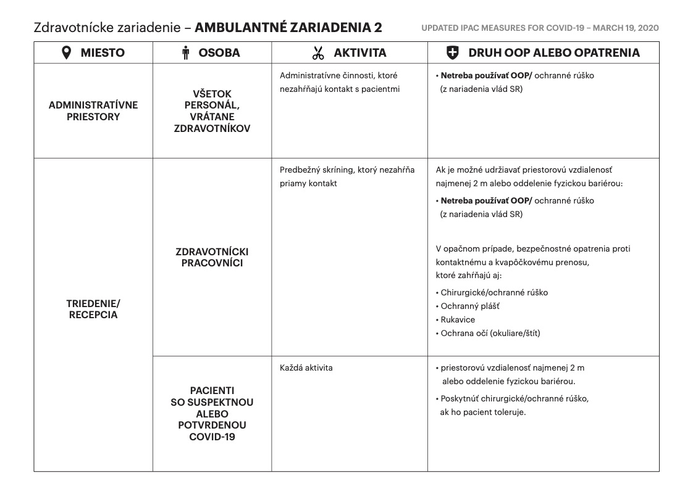
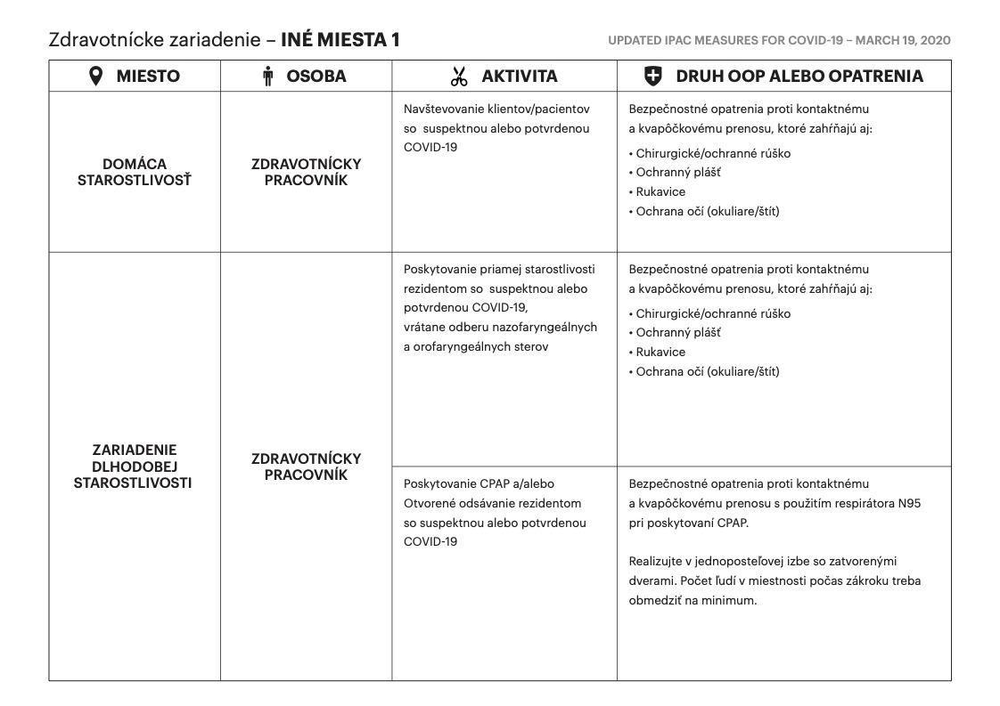
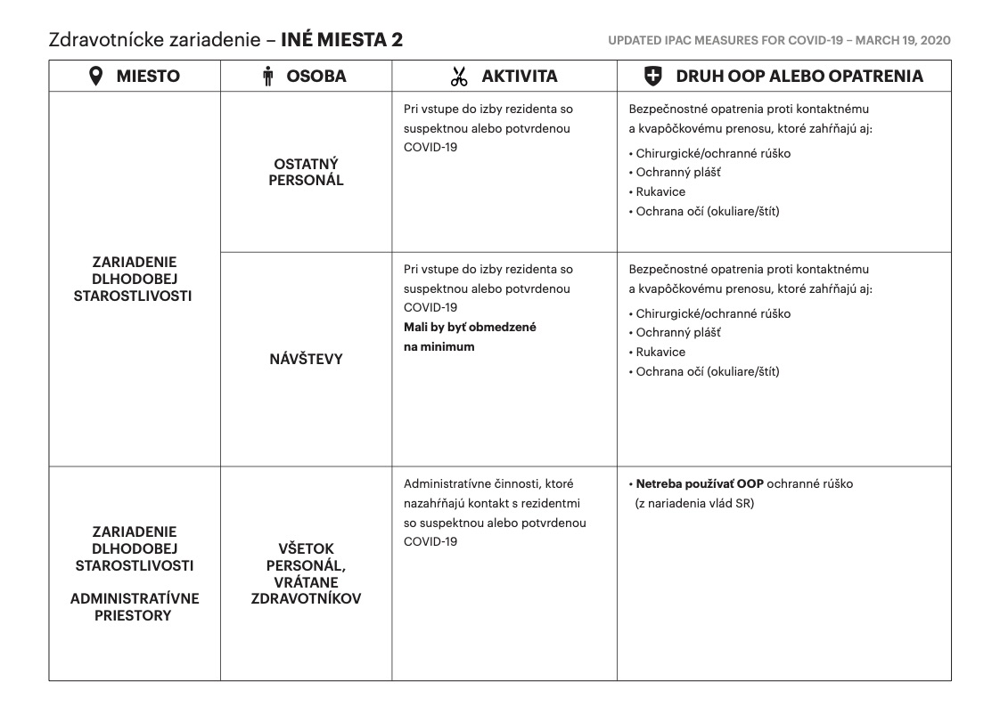

[Úvodná stránka](../../) &gt; [Plagáty](../../projekty/plagaty.md)

***
# Zhrnutie odporúčaní na osobné ochranné pomôcky pre zdravotníckych pracovníkov

## Cieľ tohto opatrenia

Tieto odporúčania informujú o minimálnych požiadavkách na osobné ochranné pomôcky (OOP), avšak, zdravotnícki pracovníci 
majú dodržiavať pravidlá používania osobných ochranných pomôcok pri prevencii a kontrole infekcií, dané vlastnou
inštitúciou alebo organizáciou. Zdravotnícki pracovníci musia pri stretnutí s pacientom zabezpečiť posúdenie rizika na
konkrétnom mieste starostlivosti (PRMS).

**Pri každom stretnutí s pacientom v každom prostredí treba dodržiavať hygienu rúk.**
## Postup pre vyvesenie na vašom pracovisku

1. Stiahnite si PDF súbor usmernení:
    * [stiahnuť usmernenia](../../files/mz/zhrnutie_opatreni_OOP_print.pdf)
2. Vytlačte si súbor na vašej tlačiarni a umiestnite na viditeľné miesto

## Náhľad opatrení

Toto je len náhľad. Na vytlačenie v dobrej kvalite si stiahnite PDF súbor vyššie.

***
Dátum poslednej aktualizácie plagátu: 27. marca 2020

> V prípade nejasností alebo otázok napíšte email na info@slovensko.help
