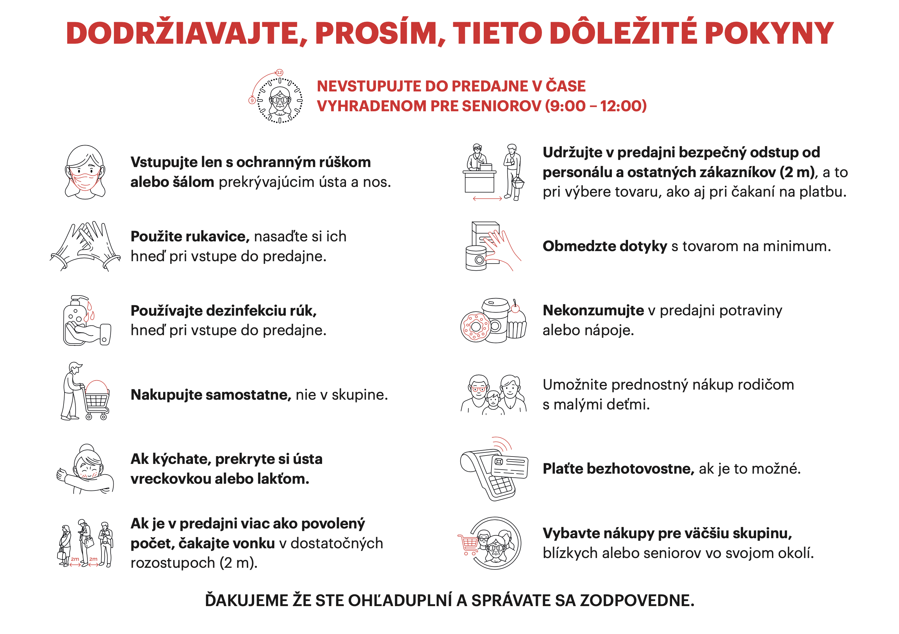
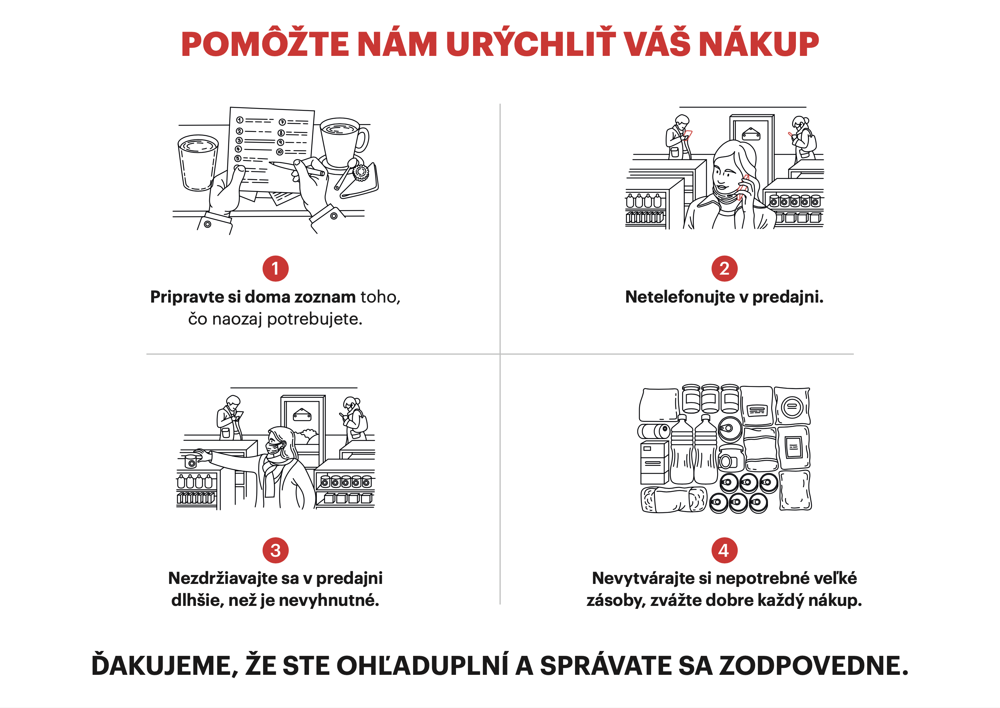

[Úvodná stránka](../../) &gt; [Plagáty](../../projekty/plagaty.md)

***
# Plagát pre predajne (a iné maloobchodné prevádzky)

## Cieľ tohto opatrenia

Minimalizovať čas, ktorý zákazník trávi v predajni, počet ľudí, s ktorými príde do kontaktu a viesť zákazníkov k zodpovednému správaniu počas prítomnosti v predajni.

## Postup pre vyvesenie na dvere predajne

1. Stiahnite si PDF súbor plagátu:
    * [stiahnuť slovenský plagát](../../files/predajne/predajne-plagat-v2020032901.pdf)
2. Vytlačte si súbor na vašej tlačiarni a umiestnite dve A4 na viditeľné miesto pri vstupe do predajne (napríklad vstupné dvere)

## Náhľad plagátu

Toto je len náhľad. Na vytlačenie v dobrej kvalite si stiahnite PDF súbor vyššie.

***
Dátum poslednej aktualizácie plagátu: 29. marca 2020

> V prípade nejasností alebo otázok napíšte email na info@slovensko.help
